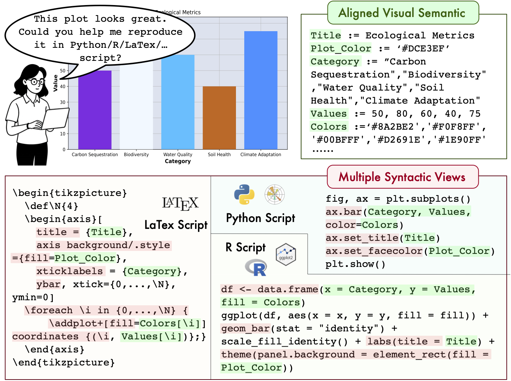
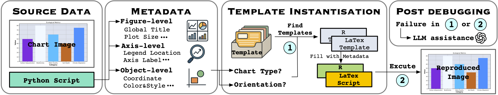
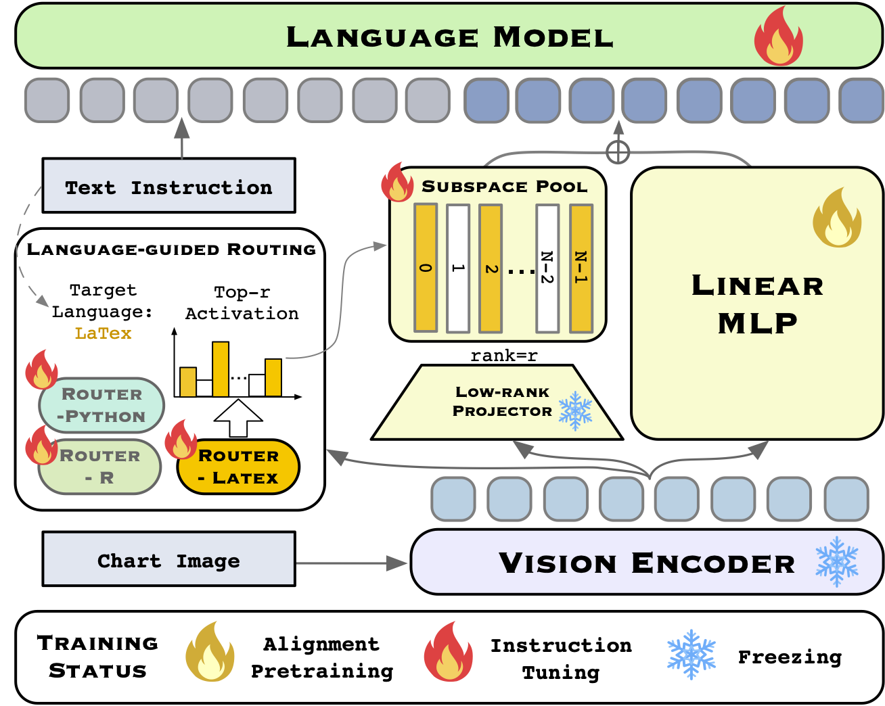

# Aligned Multi-View Scripts for Universal Chart-to-Code Generation

This repository is the official codebase for **Aligned Multi-View Scripts for Universal Chart-to-Code Generation**, accepted by **ACL 2026 Main Conference**.

[](https://arxiv.org/abs/2604.24559)
[](https://huggingface.co/datasets/Zhihan/Chart2NCode)
[](https://huggingface.co/Zhihan/CharLuMA-1.3B)
[](https://huggingface.co/Zhihan/CharLuMA-6.7B)

---

## Introduction

A single chart can be reproduced by many *equivalent* plotting scripts — Python with `matplotlib`, R with `ggplot2`, LaTeX with `pgfplots`, and so on. Each rendering path is a different *syntactic view* of the same underlying *visual semantics* (title, axes, marks, colors, layout). Existing chart-to-code work overwhelmingly targets Python alone, leaving this cross-language alignment as an unused, abundant source of supervision.

<p align="center">
  
</p>

We exploit it on two fronts:

- **Chart2NCode** — a 176K-chart dataset where every chart is paired with three *aligned* scripts (Python, R, LaTeX) that render visually equivalent images. The scripts are produced by a metadata-to-template pipeline with rendering-based verification, so alignment is mechanical rather than learned.
- **CharLuMA** — a parameter-efficient adapter on top of a LLaVA-style MLLM. The multimodal projector is augmented with a *language-conditioned mixture of low-rank subspaces*, sharing chart understanding across languages while specializing code generation to the target language via lightweight routing.

This repository releases:
- The automatic annotation pipeline (`dataset_construction/`) and a random subset of Chart2NCode (`dataset_construction/sample_Chart2NCode/`); the full 176K dataset is hosted on Hugging Face.
- Model architecture code (`llava/`) and training scripts (`scripts/`); pretrained CharLuMA-1.3B and CharLuMA-6.7B checkpoints are hosted on Hugging Face.

## Install Environment

We develop on Python 3.12 with PyTorch 2.6 + CUDA 12.4. To reproduce our environment:

```bash
conda create -n charluma python=3.12 -y
conda activate charluma

# 1. install torch first, matching your CUDA driver (we use cu124)
pip install torch==2.6.0 torchvision==0.21.0 torchaudio==2.6.0 --index-url https://download.pytorch.org/whl/cu124

# 2. install the rest of the pinned stack
pip install -r requirements.txt
```

## Chart2NCode

<p align="center">
  
</p>

The pipeline starts from a Python script and chart image, extracts figure-, axis-, and object-level metadata, instantiates per-language templates (R, LaTeX) keyed on chart type and orientation, and rejects samples whose rendered output diverges from the source — with optional LLM assistance for failed cases.

The full Chart2NCode dataset (176K charts × {Python, R, LaTeX}, with rendered images and aligned scripts in a parquet layout) is available at:

> https://huggingface.co/datasets/Zhihan/Chart2NCode

To load it directly:

```python
from datasets import load_dataset

ds = load_dataset("Zhihan/Chart2NCode")
print(ds)  # train / test splits with `image`, `python`, `r`, `latex` columns
```

To replicate the automatic annotation pipeline used to generate Chart2NCode, run:

```bash
bash dataset_construction/main.sh
```

Note: this release currently includes the templates and template-filling scripts for area, bar, and box charts. A random subset is mirrored under `dataset_construction/sample_Chart2NCode/` for quick inspection without downloading the full dataset.

## CharLuMA

<p align="center">
  
</p>

CharLuMA augments a LLaVA-style projector with a *subspace pool* of low-rank components and a per-language router. At inference, the target language (Python / R / LaTeX) selects a top-r subset of subspaces, which are combined with a shared linear MLP path before flowing into the language model. The vision encoder and the low-rank projector remain frozen during instruction tuning; only the router, subspace pool, MLP, and LM are updated.

Pretrained checkpoints are available on Hugging Face:

| Model         | Backbone                       | Link                                                              |
|---------------|--------------------------------|-------------------------------------------------------------------|
| CharLuMA-1.3B | DeepSeek-Coder-1.3B-Instruct   | https://huggingface.co/Zhihan/CharLuMA-1.3B                       |
| CharLuMA-6.7B | DeepSeek-Coder-6.7B-Instruct   | https://huggingface.co/Zhihan/CharLuMA-6.7B                       |

The published `config.json` references the language backbone and the SigLIP vision tower under the placeholder path `/your_local_path/`. Replace it with your local download paths (or public model IDs) before loading.

### Training

The training strategy consists of two stages: alignment pretraining and instruction tuning.

For **alignment pretraining**, run:

```bash
bash scripts/pretrain_modality_alignment.sh
```

Instruction tuning is divided into a warm-up phase followed by the full training of the adapter and language model backbone. First, warm-up the model:

```bash
bash scripts/finetune_warmup.sh
```

Then, train the adapter and language model backbone:

```bash
bash scripts/finetune_instruction_tuning.sh
```

### Inference

```bash
python scripts/inference_charluma.py
```

## Citation

If you find Chart2NCode or CharLuMA useful, please cite:

```bibtex
@misc{zhang2026aligned,
  title         = {Aligned Multi-View Scripts for Universal Chart-to-Code Generation},
  author        = {Zhihan Zhang and Lizi Liao},
  year          = {2026},
  eprint        = {2604.24559},
  archivePrefix = {arXiv},
  primaryClass  = {cs.CL},
  doi           = {10.48550/arXiv.2604.24559},
  url           = {https://arxiv.org/abs/2604.24559}
}
```

## Acknowledgement

The model architecture and training scripts are built upon [LLaVA](https://github.com/haotian-liu/LLaVA). We also draw on [ChartMoE](https://github.com/DataArcTech/ChartMoE) and [ChartCoder](https://github.com/thunlp/ChartCoder). We thank the authors of these projects for their contributions to the open-source community.
